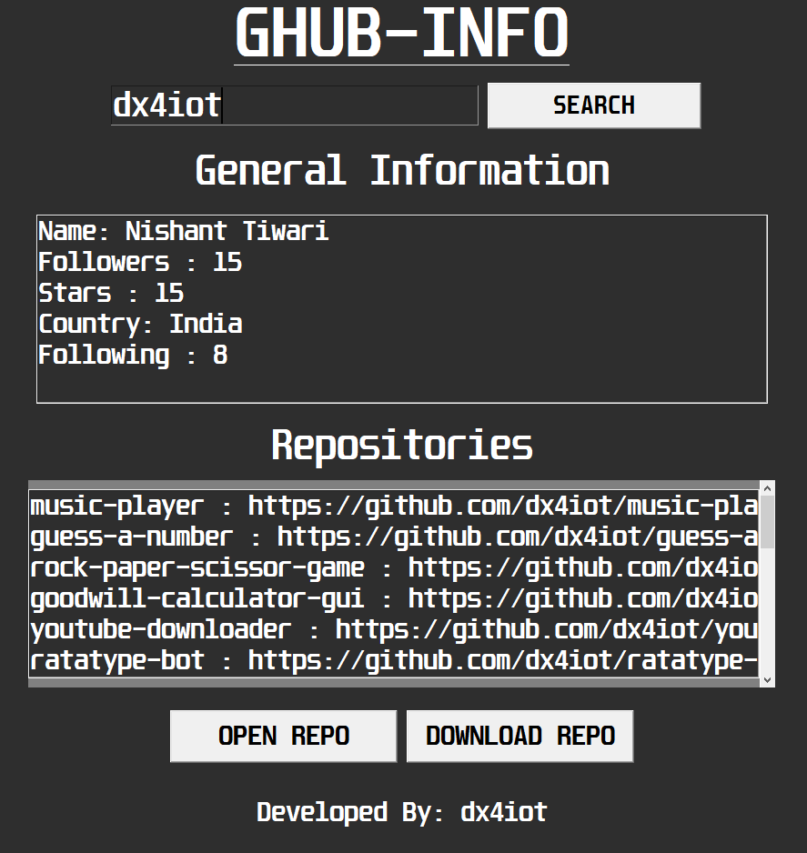

<b>GHUB-INFO | Find open source info about any github profile</b>

# GHUB-INFO
GHUB-INFO is a program to find open source info about any github profile Like <b>(followers, stars, following, country, organization, etc)</b>

# Features 🌟
👉 Find your repo easily

👉 Download and Open your repo in just one click 

# SCREENSHOT 📸

## Contact Me ☎

#### Gmail: dx4iot@gmail.com

#### Instagram: https://www.instagram.com/dx4iot/

#### LinkedIn: https://www.linkedin.com/in/dx4iot

#### Facebook: https://www.facebook.com/dx4iot/

